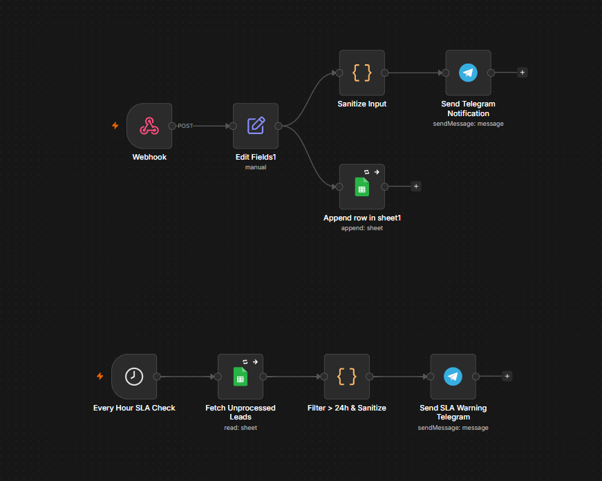

# 🛡️ n8n Lead Automation & SLA Monitoring System

یک سیستم خودکار مدیریت لیدها و مانیتورینگ سطح پاسخگویی (SLA) جهت دریافت داده‌های فرم، ذخیره‌سازی منظم در Google Sheets و ارسال هشدار خودکار در صورت عدم بررسی لیدها توسط تیم فروش.

---

## 📺 پیش‌نمایش و دمو (Demo)

برای مشاهده عملکرد زنده و سریع سیستم از زمان ثبت فرم تا بررسی SLA و ارسال هشدار در تلگرام، بخش‌های زیر را مشاهده کنید:

### 🎬 ویدیو دمو (Video Preview)
> 💡 **نکته:** فیلم کوتاه نحوه کارکرد سیستم و ارسال هشدارها را می‌توانید در کادر زیر مشاهده کنید:

---

### 🖼️ اسکرین‌شات جریان کاری (Workflow Canvas)

---

## 🌟 ویژگی‌های کلیدی سیستم (Key Features)

* **دریافت آنی لیدها (Instant Capture):** دریافت آنی داده‌های فرم از طریق Webhook و تفکیک سریع فیلدها.
* **ایمن‌سازی داده‌ها (Data Sanitization):** خنثی‌سازی کاراکترهای خاص HTML در ورودی‌ها جهت جلوگیری از کرش نود تلگرام.
* **ذخیره‌سازی یکپارچه (Google Sheets Integration):** درج خودکار مشخصات مشتری و وضعیت اولیه لید در دیتابیس گوگل شیت.
* **اطلاع‌رسانی فوری (Real-time Alert):** ارسال مشخصات کامل درخواست پشتیبانی به چت یا گروه تیم فروش در تلگرام.
* **پایش زمان‌بندی‌شده SLA (Automated SLA Checking):** بررسی دوره‌ای ساعتی جهت شناسایی لیدهای تعیین‌تکلیف‌نشده.
* **ارسال هشدار تاخیر (Overdue Warning):** ارسال پیام هشدار مجزا در صورت بگذشت بیش از ۲۴ ساعت از ثبت لید و عدم تغییر وضعیت آن.
* **معماری بدون معطلی (Wait-Free Architecture):** عدم استفاده از نود Wait جهت حفظ بهینه حافظه سرور VPS و پایداری در اجرا.

---

## 🛠️ تکنولوژی‌ها و ابزارهای استفاده‌شده

* **n8n:** بستر اصلی طراحی منطق و اتوماسیون پروژه‌ها.
* **JavaScript (Node.js):** پردازش داده‌ها، محاسبات زمانی (سنجش ۲۴ ساعت) و ایمن‌سازی متون جهت ارسال به تلگرام.
* **Google Sheets API:** به‌عنوان پایگاه‌داده جهت ذخیره اطلاعات لیدها و مدیریت وضعیت آن‌ها.
* **Telegram Bot API:** ارسال هشدارهای فوری به کارشناسان فروش و پشتیبانی.
* **Webhooks:** جهت دریافت دیتای آنی از فرم‌های وب‌سایت (WordPress / Gravity Forms / Elementor).

---

## 📐 ساختار دیتابیس و جدول (Data Architecture)

این سیستم از یک جدول اصلی در Google Sheets برای مدیریت داده‌ها استفاده می‌کند:

### 📑 جدول اصلی لیدها (Sheet1)

* **ایدی فرم (`entry_id`):** شناسه اختصاصی هر فرم ثبت‌شده.
* **نام و نام خانوادگی (`first_name` / `last_name`):** اطلاعات هویتی کاربر.
* **آدرس سایت (`website_url`):** دامنه وب‌سایت مشتری.
* **نوع سرویس (`service_type`):** خدمت درخواستی (سئو، پشتیبانی، توسعه).
* **سطح اضطراری (`urgency`):** میزان اولویت درخواست.
* **ایمیل (`email`):** آدرس الکترونیکی کاربر.
* **وضعیت لید (`status`):** وضعیت فعلی (مثلاً: `نیاز به بررسی` / `بررسی شد`).
* **تاریخ ثبت (`created_at`):** زمان دقیق ثبت درخواست (مبنای محاسبه ۲۴ ساعت SLA).

---

## 🚀 نحوه راه اندازی (Installation & Setup)

1. **فراخوانی وورک‌فلو:**
   * فایل `WordPress-Lead-Automation-SLA.json` موجود در این ریپازیتوری را دانلود کنید.
   * در محیط n8n خود از منوی بالا گزینه **Import from File** را انتخاب و فایل را وارد کنید.

2. **تنظیم Google Sheets:**
   * یک فایل Google Sheets بسازید و ستون‌های ذکر شده در بخش ساختار داده را در سطر اول ایجاد کنید.
   * دسترسی اتصال به Google Sheets را در نودهای مربوطه برقرار کنید.

3. **تنظیم ربات تلگرام:**
   * توکن ربات تلگرام و `Chat ID` مقصد را در نودهای ارسال پیام تنظیم کنید.

4. **اتصال Error Handler (اختیاری و پیشنهادی):**
   * جهت پایش خطاهای احتمالی، در تنظیمات وورک‌فلو (`Workflow Settings`) گزینه **Error Workflow** را روی وورک‌فلوی متمرکز Error Handler خود قرار دهید.
